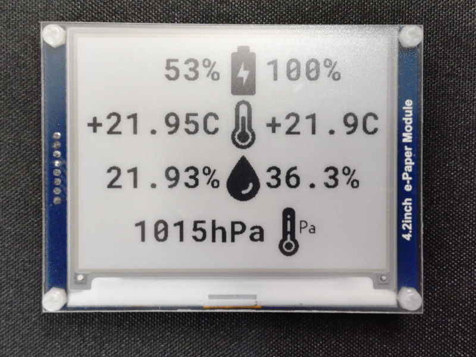

## xiao-weather-frame

Weather Display Frame based on the XIAO nRF52840 dev board, Waveshare 4.2inch e-Paper Display module and bme280 (temperature/humidity/pressure) sensor.  
* Implements Bluetooth LE Central role to communicate with the external [XIAO nRF52840 and bme280 based BLE weather station peripheral device](https://github.com/Hypnotriod/xiao-sense-bme280) over Environmental Sensing Service (ESS) and Battery Service (BAS).  
* EPD SPI library is based on the `EPD_4in2.c` file from the Waveshare STM32 [demo samples](https://files.waveshare.com/upload/7/71/E-Paper_code.zip). (Note that this implementation is compatible with the V1 revision with slower display refresh)
* Internal LiPo Battery is managed by the [xiao_sense_nrf52840_battery_lib](https://github.com/Tjoms99/xiao_sense_nrf52840_battery_lib).  

### Links
* [Bitmap To Array](https://www.freedevelopertools.com/bitmap-to-array)
* [STM32 LCD Font Generator](https://github.com/zst-embedded/STM32-LCD_Font_Generator)
* [Waveshare 4.2inch e-Paper Module manual](https://www.waveshare.com/wiki/4.2inch_e-Paper_Module_Manual#Working_With_STM32)
